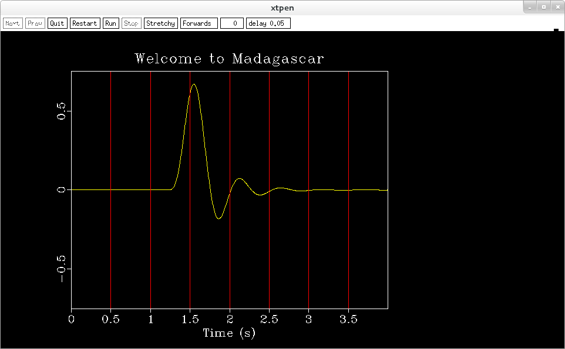

Linux下安装Madagascar
#############################

:author: pzhang
:date: 2015-10-26
:category: Linux
:tags: Linux, 安装
:slug: install-madagascar

.. contents::

Madagascar 是与Seismic_Unix 以及 SEPlib 差不多的一套东西。

依赖
=============

基础依赖包
------------

.. code-block:: bash

    $ sudo yum install gcc libXaw-devel python

值的注意的是，Madagascar只支持Python2

核心及开发依赖
----------------

.. code-block:: bash

    $ sudo yum install gcc-c++ gcc-gfortran       # c++和fortran
    $ sudo yum install python-devel swig numpy    # Python API
    $ sudo yum install java     # Java API

要用到MATLAB API的话，自然得安装MATLAB

图形和可视化
---------------

.. code-block:: bash

    $ sudo yum install libXaw-devel gifsicle libtiff-devel libjpeg-devel plplot-devel
    $ sudo yum install freeglut freeglut-devel netpbm netpbm-devel
    $ sudo yum install suitesparse suitesparse-devel
    $ sudo yum install gd gd-devel      # PNG support
    $ sudo yum install cairo cairo-devel
    
分别为X11 graphics, vplot2gif, TIFF, JPEG, PLplot, OpenGL和ppm支持

数值依赖包
-------------

.. code-block:: bash

    $ sudo yum install blas blas-devel atlas atlas-devel lapack lapack-devel
    $ sudo yum install mpich mpich-devel mpicc-devel openmpi openmpi-devel
    $ sudo yum install fftw fftw-devel
    
其他
-----------

- Seismic_Unix
- CurveLab, PyCurveLab
- 

下载安装
============

`Download the source code distribution from Sourceforge <http://sourceforge.net/projects/rsf/files/>`_

.. code-block:: bash

    $ tar jxvf madagascar-1.7.tar.bz2
    $ cd madagascar-1.7
    $ ./configure --preifx=/home/pzhang/seisCode/rsf API=f90,python,matlab
    $ make
    $ sudo make install

添加环境变量
==============

.. code-block:: bash

    $ echo "source /home/pzhang/rsf/share/madagascar/etc/env.sh" >> ~/.bashrc
    $ source ~/.bashrc
    
卸载
===========

清除所有中间文件和安装文件

::

    $ scons -c install

或者在源码文件夹中
::

    $ make distclean
    
测试
==========

::

    $ sfspike n1=1000 k1=300 | sfbandpass fhi=2 phase=y | \
        sfwiggle clip=0.02 title="Welcome to Madagascar" | sfpen
        
不出错且出现如下图形即安装成功

    

存在的问题
=================

即使安装了blas和lapack，``configure`` 时候仍然是NO::

    checking for BLAS ... no
    checking for LAPACK ... no
    checking for SWIG ... (cached) /usr/bin/swig

参考
============

- `Madagascar Installation <http://www.ahay.org/wiki/Installation#Precompiled_binary_packages>`_
- `Advanced Installation <http://www.ahay.org/wiki/Advanced_Installation#Platform-specific_installation_advice>`_

    

