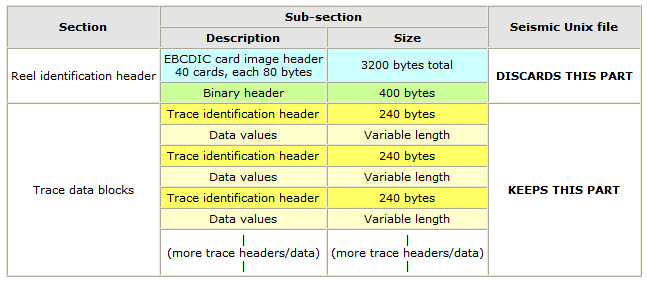
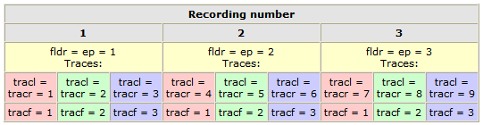

SU/SEGY文件格式
######################

:date: 2016-02-29
:author: pzhang
:category: Seismic_Unix
:tags: SU/SEGY
:slug: su-and-segy-format

.. contents::

序言
=============

地震勘探中，地震数据是以地震道为单位进行组织的，最常用的格式即为SEG-Y格式，这种格式是由
SEG(Society of Exploration Geophysicists)提出的标准磁带数据格式之一，是石油行业使用
最为普遍的格式。而SU格式是 Seismic_Unix 软件包使用的数据格式，可以看作的SEGY格式的简化，
由于 Seismic_Unix 软件的广泛使用，该种格式也有着普遍的使用。

SEG-Y数据格式
=======================

SEGY数据格式包括三个部分。

- ``EBCDIC``：Extended Binary Coded Decimak Interchange Code,主要用于IBM计算机，
- ``32位IBM浮点型``: IBM格式和现代IBM PC所用的IEEE格式是不同的

对于数据的读写主要在于要弄清楚数据的组成，而SEGY和SU文件格式的重要组成部分都是道头，类似于
SAC文件的头段。道头记录了数据的一些基本信息。

SEGY卷头文件3200字节EBCDIC码内容
------------------------------------

.. code-block:: bash

    C      This tape was made at the                                               
    C                                                                              
    C      Center for Wave Phenomena                                               
    C      Colorado School of Mines                                                
    C      Golden, CO, 80401                                                       
    C                                                                              
    C                                                                              
    C                                                                              
    C                                                                              
    C                                                                              
    C                                                                              
    C                                                                              
    C                                                                              
    C                                                                              
    C                                                                              
    C                                                                              
    C                                                                              
    C                                                                              
    C                                                                              
    C                                                                              
    C                                                                              
    C                                                                              
    C                                                                              
    C                                                                              
    C                                                                              
    C                                                                              
    C                                                                              
    C                                                                              
    C                                                                              
    C                                                                              
    C                                                                              
    C                                                                              
    C                                                                              
    C                                                                              
    C                                                                              
    C                                                                              
    C                                                                              
    C                                                                              
    C                                                                              
    C                                                                              
    
SEGY卷头文件400字节二进制内容表
-----------------------------------

+-----------+-------------+----------------+--------------------------+
| 字节      | 参数名      | 参数类型       | 参数说明                 |
+===========+=============+================+==========================+
| 3201-3204 | jobid       | int            | 任务识别码               |
+-----------+-------------+----------------+--------------------------+
| 3205-3208 | lino        | int            | 测线号                   |
+-----------+-------------+----------------+--------------------------+
| 3209-3212 | reno        | int            | 卷号                     |
+-----------+-------------+----------------+--------------------------+
| 3213-3214 | ntrpr       | short          | 每个记录的道数           |
+-----------+-------------+----------------+--------------------------+
| 3215-3216 | nart        | short          | 每个记录的辅助道数       |
+-----------+-------------+----------------+--------------------------+
| 3217-3218 | hdt         | unsigned short | 该卷采样间隔(微秒)       |
+-----------+-------------+----------------+--------------------------+
| 3219-3220 | dto         | unsigned short | 原始记录的采样间隔(微秒) |
+-----------+-------------+----------------+--------------------------+
| 3221-3222 | hns         | unsigned short | 该卷每道的样点数         |
+-----------+-------------+----------------+--------------------------+
| 3223-3224 | nso         | unsigned short | 原始记录的每道的采样点   |
+-----------+-------------+----------------+--------------------------+
| 3225-3226 | format      | short          | 数据采样点的记录格式     |
+-----------+-------------+----------------+--------------------------+
| 3227-3228 | fold        | short          | CMP 覆盖次数             |
+-----------+-------------+----------------+--------------------------+
| 3229-3230 | tsort       | short          | 道分选码                 |
+-----------+-------------+----------------+--------------------------+
| 3231-3232 | vscode      | short          | 垂直和码                 |
+-----------+-------------+----------------+--------------------------+
| 3233-3234 | hsfs        | short          | 起始扫描频率             |
+-----------+-------------+----------------+--------------------------+
| 3235-3236 | hsfe        | short          | 终止扫描频率             |
+-----------+-------------+----------------+--------------------------+
| 3237-3238 | hslen       | short          | 扫描时窗                 |
+-----------+-------------+----------------+--------------------------+
| 3239-3240 | hstyp       | short          | 扫描类型                 |
+-----------+-------------+----------------+--------------------------+
| 3241-3242 | schn        | short          | 扫描频带道数             |
+-----------+-------------+----------------+--------------------------+
| 3243-3244 | hstas       | short          | 斜坡扫描起始时间         |
+-----------+-------------+----------------+--------------------------+
| 3245-3246 | hstae       | short          | 斜坡扫描终止时间         |
+-----------+-------------+----------------+--------------------------+
| 3247-3248 | htatyp      | short          | 斜坡扫描类型             |
+-----------+-------------+----------------+--------------------------+
| 3249-3250 | hcorr       | short          | 相关数据道               |
+-----------+-------------+----------------+--------------------------+
| 3251-3252 | bgrcv       | short          | 增益恢复                 |
+-----------+-------------+----------------+--------------------------+
| 3253-3254 | rcvm        | short          | 振幅恢复方法             |
+-----------+-------------+----------------+--------------------------+
| 3255-3256 | mfeet       | short          | 测量系统                 |
+-----------+-------------+----------------+--------------------------+
| 3257-3258 | polyt       | short          | 激发信号极性             |
+-----------+-------------+----------------+--------------------------+
| 3259-3260 | vpol        | short          | 振动极性                 |
+-----------+-------------+----------------+--------------------------+
| 3261-3600 | hunass[170] | short          | 无定义                   |
+-----------+-------------+----------------+--------------------------+

SEG-Y定义的240字节道头变量列表
-------------------------------------

+---------+------------+----------+--------------------------------------------------------------------------------------------+
| 字节数  | 参数名     | 参数类型 | 参数描述                                                                                   |
+=========+============+==========+============================================================================================+
| 1-4     | **tracl**  | int      | Trace sequence number within line.                                                         |
+---------+------------+----------+--------------------------------------------------------------------------------------------+
| 5-8     | tracr      | int      | Trace sequence number within file (reel)                                                   |
+---------+------------+----------+--------------------------------------------------------------------------------------------+
| 9-12    | **fldr**   | int      | Original field record number                                                               |
+---------+------------+----------+--------------------------------------------------------------------------------------------+
| 13-16   | **tracf**  | int      | Trace number within original field record                                                  |
+---------+------------+----------+--------------------------------------------------------------------------------------------+
| 17-20   | ep         | int      | Energy source point number.                                                                |
+---------+------------+----------+--------------------------------------------------------------------------------------------+
| 21-24   | cdp        | int      | CDP ensemble number.                                                                       |
+---------+------------+----------+--------------------------------------------------------------------------------------------+
| 25-28   | cdpt       | int      | Trace number within the CDP ensemble.                                                      |
+---------+------------+----------+--------------------------------------------------------------------------------------------+
| 29-30   | **trid**   | short    | Trace identification code: 1 = seismic data                                                |
+---------+------------+----------+--------------------------------------------------------------------------------------------+
| 31-32   | nvs        | short    | Number of vertically summed traces yielding this trace                                     |
+---------+------------+----------+--------------------------------------------------------------------------------------------+
| 33-34   | nhs        | short    | Number of horizontally stacked traces yielding this trace                                  |
+---------+------------+----------+--------------------------------------------------------------------------------------------+
| 35-36   | duse       | short    | Data use: 1 = production 2 = test                                                          |
+---------+------------+----------+--------------------------------------------------------------------------------------------+
| 37-40   | offset     | int      | Distance from source point to receiver group.                                              |
+---------+------------+----------+--------------------------------------------------------------------------------------------+
| 41-44   | gelev      | int      | Receiver group elevation-above sea level are positive, or are negative.                    |
+---------+------------+----------+--------------------------------------------------------------------------------------------+
| 45-48   | selev      | int      | Surface elevation at source.                                                               |
+---------+------------+----------+--------------------------------------------------------------------------------------------+
| 49-52   | sdepth     | int      | Source depth below surface (positive number).                                              |
+---------+------------+----------+--------------------------------------------------------------------------------------------+
| 53-56   | gdel       | int      | Datum elevation at receiver group.                                                         |
+---------+------------+----------+--------------------------------------------------------------------------------------------+
| 57-60   | sdel       | int      | Datum elevation at source.                                                                 |
+---------+------------+----------+--------------------------------------------------------------------------------------------+
| 61-64   | swdep      | int      | Water depth at source(this is the Fish depth below the sea surface in meters*10)           |
+---------+------------+----------+--------------------------------------------------------------------------------------------+
| 65-68   | gwdep      | int      | Water depth at group.                                                                      |
+---------+------------+----------+--------------------------------------------------------------------------------------------+
| 69-70   | scalel     | short    | Scalar to be applied to the previous 7 entries                                             |
+---------+------------+----------+--------------------------------------------------------------------------------------------+
| 71-72   | scalco     | short    | Scalar to be applied to the next 4 entries                                                 |
+---------+------------+----------+--------------------------------------------------------------------------------------------+
| 73-76   | **sx**     | int      | Source coordinate -Longitude                                                               |
+---------+------------+----------+--------------------------------------------------------------------------------------------+
| 77-80   | **sy**     | int      | Source coordinate - Latitude                                                               |
+---------+------------+----------+--------------------------------------------------------------------------------------------+
| 81-84   | **gx**     | int      | Group coordinate - Longitude                                                               |
+---------+------------+----------+--------------------------------------------------------------------------------------------+
| 85-88   | **gy**     | int      | Group coordinate - Latitude                                                                |
+---------+------------+----------+--------------------------------------------------------------------------------------------+
| 89-90   | **conuit** | short    | Coordinate units: 1=length(meters or feet) 2=seconds of arc                                |
+---------+------------+----------+--------------------------------------------------------------------------------------------+
| 91-92   | wevel      | short    | weathering velocity.                                                                       |
+---------+------------+----------+--------------------------------------------------------------------------------------------+
| 93-94   | swevel     | short    | Subweathering velocity.                                                                    |
+---------+------------+----------+--------------------------------------------------------------------------------------------+
| 95-96   | sut        | short    | Uphole time at source.                                                                     |
+---------+------------+----------+--------------------------------------------------------------------------------------------+
| 97-98   | gut        | short    | Uphole time at group.                                                                      |
+---------+------------+----------+--------------------------------------------------------------------------------------------+
| 99-100  | sstat      | short    | Source static correction.                                                                  |
+---------+------------+----------+--------------------------------------------------------------------------------------------+
| 101-102 | gstat      | short    | Group static correction.                                                                   |
+---------+------------+----------+--------------------------------------------------------------------------------------------+
| 103-104 | tstat      | short    | Total static applied.                                                                      |
+---------+------------+----------+--------------------------------------------------------------------------------------------+
| 105-106 | laga       | short    | Lag time A (ms).                                                                           |
+---------+------------+----------+--------------------------------------------------------------------------------------------+
| 107-108 | lagb       | short    | Lag time B. Time in ms between the time break and positive or negative.                    |
+---------+------------+----------+--------------------------------------------------------------------------------------------+
| 109-110 | delrt      | short    | Delay recording time.                                                                      |
+---------+------------+----------+--------------------------------------------------------------------------------------------+
| 111-112 | muts       | short    | Mute time - start.                                                                         |
+---------+------------+----------+--------------------------------------------------------------------------------------------+
| 113-114 | mute       | short    | Mute time - end.                                                                           |
+---------+------------+----------+--------------------------------------------------------------------------------------------+
| 115-116 | **ns**     | un short | Number of samples in this trace.                                                           |
+---------+------------+----------+--------------------------------------------------------------------------------------------+
| 117-118 | **dt**     | un short | Sample interval of this trace in microseconds .                                            |
+---------+------------+----------+--------------------------------------------------------------------------------------------+
| 119-120 | gain       | short    | Gain type of field instruments                                                             |
+---------+------------+----------+--------------------------------------------------------------------------------------------+
| 121-122 | igc        | short    | Instrument gain constant.                                                                  |
+---------+------------+----------+--------------------------------------------------------------------------------------------+
| 123-124 | **igi**    | short    | Instrument early or initial gain (db).                                                     |
+---------+------------+----------+--------------------------------------------------------------------------------------------+
| 125-126 | corr       | short    | Correlated: 1 = no 2 = yes                                                                 |
+---------+------------+----------+--------------------------------------------------------------------------------------------+
| 127-128 | sfs        | short    | Sweep frequency at start.                                                                  |
+---------+------------+----------+--------------------------------------------------------------------------------------------+
| 129-130 | sfe        | short    | Sweep frequency at end.                                                                    |
+---------+------------+----------+--------------------------------------------------------------------------------------------+
| 131-132 | slen       | short    | Sweep length (ms).                                                                         |
+---------+------------+----------+--------------------------------------------------------------------------------------------+
| 133-134 | styp       | short    | Sweep type: 1 = linear 2 = parabolic 3 = exponential 4 = other                             |
+---------+------------+----------+--------------------------------------------------------------------------------------------+
| 135-136 | stas       | short    | Sweep trace taper length at start (ms).                                                    |
+---------+------------+----------+--------------------------------------------------------------------------------------------+
| 137-138 | stae       | short    | Sweep trace taper length at end, ms.                                                       |
+---------+------------+----------+--------------------------------------------------------------------------------------------+
| 139-140 | tatyp      | short    | Taper type: 1 = linear 2 = cos 3 = other                                                   |
+---------+------------+----------+--------------------------------------------------------------------------------------------+
| 141-142 | **afilf**  | short    | Alias filter frequency.                                                                    |
+---------+------------+----------+--------------------------------------------------------------------------------------------+
| 143-144 | **afils**  | short    | Alias filter slope.                                                                        |
+---------+------------+----------+--------------------------------------------------------------------------------------------+
| 145-146 | nofilf     | short    | Notch filter frequency.                                                                    |
+---------+------------+----------+--------------------------------------------------------------------------------------------+
| 147-148 | nofils     | short    | Notch filter slope.                                                                        |
+---------+------------+----------+--------------------------------------------------------------------------------------------+
| 149-150 | lcf        | short    | Low cut frequency.                                                                         |
+---------+------------+----------+--------------------------------------------------------------------------------------------+
| 151-152 | hcf        | short    | High cut frequency.                                                                        |
+---------+------------+----------+--------------------------------------------------------------------------------------------+
| 153-154 | lcs        | short    | Low cut slope.                                                                             |
+---------+------------+----------+--------------------------------------------------------------------------------------------+
| 155-156 | hcs        | short    | High cut slope.                                                                            |
+---------+------------+----------+--------------------------------------------------------------------------------------------+
| 157-158 | **year**   | short    | Year data recorded (four digit integer).                                                   |
+---------+------------+----------+--------------------------------------------------------------------------------------------+
| 159-160 | **day**    | short    | Day of year.                                                                               |
+---------+------------+----------+--------------------------------------------------------------------------------------------+
| 161-162 | **hour**   | short    | Hour of day (24 hour clock).                                                               |
+---------+------------+----------+--------------------------------------------------------------------------------------------+
| 163-164 | **minute** | short    | Minute of hour.                                                                            |
+---------+------------+----------+--------------------------------------------------------------------------------------------+
| 165-166 | **sec**    | short    | Second of minute.                                                                          |
+---------+------------+----------+--------------------------------------------------------------------------------------------+
| 167-168 | timbas     | short    | Time basis code: 1 = local 2 = GMT 3 = other                                               |
+---------+------------+----------+--------------------------------------------------------------------------------------------+
| 169-170 | **trwf**   | short    | Trace weighting factor,defined as 2-N volts for the least significant bit.(N=0,1,.,32,767) |
+---------+------------+----------+--------------------------------------------------------------------------------------------+
| 171-172 | grnors     | short    | Geophone group number of roll switch position one.                                         |
+---------+------------+----------+--------------------------------------------------------------------------------------------+
| 173-174 | grnlof     | short    | Geophone group number of trace number one within original field record.                    |
+---------+------------+----------+--------------------------------------------------------------------------------------------+
| 175-176 | grnlof     | short    | Geophone group number of last trace within original field record.                          |
+---------+------------+----------+--------------------------------------------------------------------------------------------+
| 177-178 | gaps       | short    | Gape size (total number of groups dropped).                                                |
+---------+------------+----------+--------------------------------------------------------------------------------------------+
| 179-180 | otrav      | short    | Overtravel associated with taper at beginning or end of line: 1=down 2=up                  |
+---------+------------+----------+--------------------------------------------------------------------------------------------+
| 181-240 | null       | null     | Unassigned-for optional information. **cwp local assignments**                             |
+---------+------------+----------+--------------------------------------------------------------------------------------------+

其中粗体的变量是比较重要的，一般在SU/SEGY文件中都有值。另外需要说明的是，SEGY格式中有可选的
道头字（字节181-240）,这些道头字的使用没有标准。在SU格式中，这些字节用来存放一些绘图参数。

SU数据格式
=============

SU数据格式是基于SEGY格式的数据道部分。SEGY道和SU道的主要不同在于SU格式的道数据是浮点型，
和你运行SU程序的计算机上的浮点格式一致，SU数据只有SEGY的道部分！SU格式中不保存EBCDIC和
二进制卷头。

因此，SU数据道头基本与SEGY中的数据道头相同，差别在于道头中的181-240字节在SEGY中并没有分配，
而在SU数据中，这部分用来存放绘图参数。

SU第181-240字节道头变量
------------------------

**cwp local assignments**

+---------+-----------+-------+------------------------------------------------------+
| Bytes   | Name      | Type  | Description                                          |
+=========+===========+=======+======================================================+
| 181-184 | d1        | float | sample spacing for non-seismic data                  |
+---------+-----------+-------+------------------------------------------------------+
| 185-188 | f1        | float | first sample location for non-seismic data           |
+---------+-----------+-------+------------------------------------------------------+
| 189-192 | d2        | float | sample spacing between traces                        |
+---------+-----------+-------+------------------------------------------------------+
| 193-196 | f2        | float | first trace location                                 |
+---------+-----------+-------+------------------------------------------------------+
| 197-200 | ungpow    | float | negative of power used for dynamic range compression |
+---------+-----------+-------+------------------------------------------------------+
| 201-204 | unscale   | float | reciprocal of scaling factor to normalize            |
+---------+-----------+-------+------------------------------------------------------+
| 205-208 | ntr       | int   | number of traces                                     |
+---------+-----------+-------+------------------------------------------------------+
| 209-210 | mark      | short | mark selected traces                                 |
+---------+-----------+-------+------------------------------------------------------+
| 211-212 | shortpad  | short | alignment padding                                    |
+---------+-----------+-------+------------------------------------------------------+
| 213-240 | unass[14] | short | unassigned                                           |
+---------+-----------+-------+------------------------------------------------------+

部分道头变量之间的关系
==========================

先来重申以下以下几个变量：

- **fldr**: Original field record number
- **ep**: Energy source point number
- **tracl**: Trace sequence number within LINE
- **tracr**: Trace sequence number within REEL(or file)
- **tracf**: Trace sequence number within original field record

现在我们假设一个含有3道的地震记录。那么：

- **fldr** 和 **ep** 相等，且从1开始。
- **tracl** 和 **tracr** 相等。

如下图所示：

参考
========
#. `USING SeismicUnix <http://www.geo.uib.no/eworkshop/index.php?n=Main.SeismicUnix>`_

