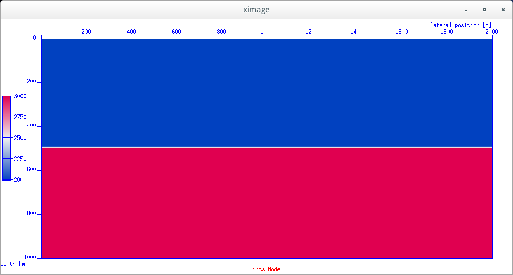

在C程序中读写SU格式文件
########################

:date: 2016-03-01
:author: pzhang
:category: Seismic_Unix
:tags: SU/SEGY
:slug: read-and-write-SU-in-c-program

.. contents::

序言
========

Seismic_Unix是处理勘探地震数据的好工具，SU文件格式是其内部的默认格式，有时候需要自己在程序
中读写SU文件。本文介绍如何在C程序中读写SU格式文件。

子函数库
==========

Seismic_Unix程序自带有子函数库，但是我没有找到相关的程序源码。。。。

但是其中自带的 ``segy.h`` 头文件可以帮助我们了解SU文件的道头格式，而且可以利用该头文件
来对SU格式的文件进行读写。

关于SU文件格式可以参考 `SU/SEGY文件格式 <{filename}/Exploration_seis/2016-02-29_SU-and-Segy-format.rst>`_ 一文。

在 ``segy.h`` 中定义了名为 ``segy`` 的结构体，其包含了SU格式的所有道头变量。

.. code-block:: C

    /* Copyright (c) Colorado School of Mines, 2011.*/
    /* All rights reserved.                       */

    /* segy.h - include file for SEGY traces
     *
     * declarations for:
     *	typedef struct {} segy - the trace identification header
     *	typedef struct {} bhed - binary header
     *
     * Note:
     *	If header words are added, run the makefile in this directory
     *	to recreate hdr.h.
     *
     * Reference:
     *	K. M. Barry, D. A. Cavers and C. W. Kneale, "Special Report:
     *		Recommended Standards for Digital Tape Formats",
     *		Geophysics, vol. 40, no. 2 (April 1975), P. 344-352.
     *
     * $Author: john $
     * $Source: /usr/local/cwp/src/su/include/RCS/segy.h,v $
     * $Revision: 1.33 $ ; $Date: 2011/11/11 23:56:14 $
     */

    #include <limits.h>
    #include "par.h"

    #ifndef SEGY_H
    #define SEGY_H
    #define TRCBYTES		240

    #define SU_NFLTS	32767	/* Arbitrary limit on data array size	*/

    /* TYPEDEFS */
    typedef struct {	/* segy - trace identification header */

    	int tracl;	/* Trace sequence number within line
    			   --numbers continue to increase if the
    			   same line continues across multiple
    			   SEG Y files.
    			   byte# 1-4
    			 */

    	int tracr;	/* Trace sequence number within SEG Y file
    			   ---each file starts with trace sequence
    			   one
    			   byte# 5-8
    			 */

    	int fldr;	/* Original field record number
    			   byte# 9-12
    			*/

    	int tracf;	/* Trace number within original field record
    			   byte# 13-16
    			*/

    	int ep;		/* energy source point number
    			   ---Used when more than one record occurs
    			   at the same effective surface location.
    			   byte# 17-20
    			 */

    	int cdp;	/* Ensemble number (i.e. CDP, CMP, CRP,...)
    			   byte# 21-24
    			*/

    	int cdpt;	/* trace number within the ensemble
    			   ---each ensemble starts with trace number one.
    			   byte# 25-28
    			 */

    	short trid;	/* trace identification code:
    			-1 = Other
    		         0 = Unknown
    			 1 = Seismic data
    			 2 = Dead
    			 3 = Dummy
    			 4 = Time break
    			 5 = Uphole
    			 6 = Sweep
    			 7 = Timing
    			 8 = Water break
    			 9 = Near-field gun signature
    			10 = Far-field gun signature
    			11 = Seismic pressure sensor
    			12 = Multicomponent seismic sensor
    				- Vertical component
    			13 = Multicomponent seismic sensor
    				- Cross-line component
    			14 = Multicomponent seismic sensor
    				- in-line component
    			15 = Rotated multicomponent seismic sensor
    				- Vertical component
    			16 = Rotated multicomponent seismic sensor
    				- Transverse component
    			17 = Rotated multicomponent seismic sensor
    				- Radial component
    			18 = Vibrator reaction mass
    			19 = Vibrator baseplate
    			20 = Vibrator estimated ground force
    			21 = Vibrator reference
    			22 = Time-velocity pairs
    			23 ... N = optional use
    				(maximum N = 32,767)

    			Following are CWP id flags:

    			109 = autocorrelation
    			110 = Fourier transformed - no packing
    			     xr[0],xi[0], ..., xr[N-1],xi[N-1]
    			111 = Fourier transformed - unpacked Nyquist
    			     xr[0],xi[0],...,xr[N/2],xi[N/2]
    			112 = Fourier transformed - packed Nyquist
    	 		     even N:
    			     xr[0],xr[N/2],xr[1],xi[1], ...,
    				xr[N/2 -1],xi[N/2 -1]
    				(note the exceptional second entry)
    			     odd N:
    			     xr[0],xr[(N-1)/2],xr[1],xi[1], ...,
    				xr[(N-1)/2 -1],xi[(N-1)/2 -1],xi[(N-1)/2]
    				(note the exceptional second & last entries)
    			113 = Complex signal in the time domain
    			     xr[0],xi[0], ..., xr[N-1],xi[N-1]
    			114 = Fourier transformed - amplitude/phase
    			     a[0],p[0], ..., a[N-1],p[N-1]
    			115 = Complex time signal - amplitude/phase
    			     a[0],p[0], ..., a[N-1],p[N-1]
    			116 = Real part of complex trace from 0 to Nyquist
    			117 = Imag part of complex trace from 0 to Nyquist
    			118 = Amplitude of complex trace from 0 to Nyquist
    			119 = Phase of complex trace from 0 to Nyquist
    			121 = Wavenumber time domain (k-t)
    			122 = Wavenumber frequency (k-omega)
    			123 = Envelope of the complex time trace
    			124 = Phase of the complex time trace
    			125 = Frequency of the complex time trace
    			130 = Depth-Range (z-x) traces
    			201 = Seismic data packed to bytes (by supack1)
    			202 = Seismic data packed to 2 bytes (by supack2)
    			   byte# 29-30
    			*/

    	short nvs;	/* Number of vertically summed traces yielding
    			   this trace. (1 is one trace,
    			   2 is two summed traces, etc.)
    			   byte# 31-32
    			 */

    	short nhs;	/* Number of horizontally summed traces yielding
    			   this trace. (1 is one trace
    			   2 is two summed traces, etc.)
    			   byte# 33-34
    			 */

    	short duse;	/* Data use:
    				1 = Production
    				2 = Test
    			   byte# 35-36
    			 */

    	int offset;	/* Distance from the center of the source point
    			   to the center of the receiver group
    			   (negative if opposite to direction in which
    			   the line was shot).
    			   byte# 37-40
    			 */

    	int gelev;	/* Receiver group elevation from sea level
    			   (all elevations above the Vertical datum are
    			   positive and below are negative).
    			   byte# 41-44
    			 */

    	int selev;	/* Surface elevation at source.
    			   byte# 45-48
    			 */

    	int sdepth;	/* Source depth below surface (a positive number).
    			   byte# 49-52
    			 */

    	int gdel;	/* Datum elevation at receiver group.
    			   byte# 53-56
    			*/

    	int sdel;	/* Datum elevation at source.
    			   byte# 57-60
    			*/

    	int swdep;	/* Water depth at source.
    			   byte# 61-64
    			*/

    	int gwdep;	/* Water depth at receiver group.
    			   byte# 65-68
    			*/

    	short scalel;	/* Scalar to be applied to the previous 7 entries
    			   to give the real value.
    			   Scalar = 1, +10, +100, +1000, +10000.
    			   If positive, scalar is used as a multiplier,
    			   if negative, scalar is used as a divisor.
    			   byte# 69-70
    			 */

    	short scalco;	/* Scalar to be applied to the next 4 entries
    			   to give the real value.
    			   Scalar = 1, +10, +100, +1000, +10000.
    			   If positive, scalar is used as a multiplier,
    			   if negative, scalar is used as a divisor.
    			   byte# 71-72
    			 */

    	int  sx;	/* Source coordinate - X
    			   byte# 73-76
    			*/

    	int  sy;	/* Source coordinate - Y
    			   byte# 77-80
    			*/

    	int  gx;	/* Group coordinate - X
    			   byte# 81-84
    			*/

    	int  gy;	/* Group coordinate - Y
    			   byte# 85-88
    			*/

    	short counit;	/* Coordinate units: (for previous 4 entries and
    				for the 7 entries before scalel)
    			   1 = Length (meters or feet)
    			   2 = Seconds of arc
    			   3 = Decimal degrees
    			   4 = Degrees, minutes, seconds (DMS)

    			In case 2, the X values are longitude and
    			the Y values are latitude, a positive value designates
    			the number of seconds east of Greenwich
    				or north of the equator

    			In case 4, to encode +-DDDMMSS
    			counit = +-DDD*10^4 + MM*10^2 + SS,
    			with scalco = 1. To encode +-DDDMMSS.ss
    			counit = +-DDD*10^6 + MM*10^4 + SS*10^2
    			with scalco = -100.
    			   byte# 89-90
    			*/

    	short wevel;	/* Weathering velocity.
    			   byte# 91-92
    			*/

    	short swevel;	/* Subweathering velocity.
    			   byte# 93-94
    			*/

    	short sut;	/* Uphole time at source in milliseconds.
    			   byte# 95-96
    			*/

    	short gut;	/* Uphole time at receiver group in milliseconds.
    			   byte# 97-98
    			*/

    	short sstat;	/* Source static correction in milliseconds.
    			   byte# 99-100
    			*/

    	short gstat;	/* Group static correction  in milliseconds.
    			   byte# 101-102
    			*/

    	short tstat;	/* Total static applied  in milliseconds.
    			   (Zero if no static has been applied.)
    			   byte# 103-104
    			*/

    	short laga;	/* Lag time A, time in ms between end of 240-
    			   byte trace identification header and time
    			   break, positive if time break occurs after
    			   end of header, time break is defined as
    			   the initiation pulse which maybe recorded
    			   on an auxiliary trace or as otherwise
    			   specified by the recording system
    			   byte# 105-106
    			*/

    	short lagb;	/* lag time B, time in ms between the time break
    			   and the initiation time of the energy source,
    			   may be positive or negative
    			   byte# 107-108
    			*/

    	short delrt;	/* delay recording time, time in ms between
    			   initiation time of energy source and time
    			   when recording of data samples begins
    			   (for deep water work if recording does not
    			   start at zero time)
    			   byte# 109-110
    			*/

    	short muts;	/* mute time--start
    			   byte# 111-112
    			*/

    	short mute;	/* mute time--end
    			   byte# 113-114
    			*/

    	unsigned short ns;	/* number of samples in this trace
    			   byte# 115-116
    			*/

    	unsigned short dt;	/* sample interval; in micro-seconds
    			   byte# 117-118
    			*/

    	short gain;	/* gain type of field instruments code:
    				1 = fixed
    				2 = binary
    				3 = floating point
    				4 ---- N = optional use
    			   byte# 119-120
    			*/

    	short igc;	/* instrument gain constant
    			   byte# 121-122
    			*/

    	short igi;	/* instrument early or initial gain
    			   byte# 123-124
    			*/

    	short corr;	/* correlated:
    				1 = no
    				2 = yes
    			   byte# 125-126
    			*/

    	short sfs;	/* sweep frequency at start
    			   byte# 127-128
    			*/

    	short sfe;	/* sweep frequency at end
    			   byte# 129-130
    			*/

    	short slen;	/* sweep length in ms
    			   byte# 131-132
    			*/

    	short styp;	/* sweep type code:
    				1 = linear
    				2 = cos-squared
    				3 = other
    			   byte# 133-134
    			*/

    	short stas;	/* sweep trace length at start in ms
    			   byte# 135-136
    			*/

    	short stae;	/* sweep trace length at end in ms
    			   byte# 137-138
    			*/

    	short tatyp;	/* taper type: 1=linear, 2=cos^2, 3=other
    			   byte# 139-140
    			*/

    	short afilf;	/* alias filter frequency if used
    			   byte# 141-142
    			*/

    	short afils;	/* alias filter slope
    			   byte# 143-144
    			*/

    	short nofilf;	/* notch filter frequency if used
    			   byte# 145-146
    			*/

    	short nofils;	/* notch filter slope
    			   byte# 147-148
    			*/

    	short lcf;	/* low cut frequency if used
    			   byte# 149-150
    			*/

    	short hcf;	/* high cut frequncy if used
    			   byte# 151-152
    			*/

    	short lcs;	/* low cut slope
    			   byte# 153-154
    			*/

    	short hcs;	/* high cut slope
    			   byte# 155-156
    			*/

    	short year;	/* year data recorded
    			   byte# 157-158
    			*/

    	short day;	/* day of year
    			   byte# 159-160
    			*/

    	short hour;	/* hour of day (24 hour clock)
    			   byte# 161-162
    			*/

    	short minute;	/* minute of hour
    			   byte# 163-164
    			*/

    	short sec;	/* second of minute
    			   byte# 165-166
    			*/

    	short timbas;	/* time basis code:
    				1 = local
    				2 = GMT
    				3 = other
    			   byte# 167-168
    			*/

    	short trwf;	/* trace weighting factor, defined as 1/2^N
    			   volts for the least sigificant bit
    			   byte# 169-170
    			*/

    	short grnors;	/* geophone group number of roll switch
    			   position one
    			   byte# 171-172
    			*/

    	short grnofr;	/* geophone group number of trace one within
    			   original field record
    			   byte# 173-174
    			*/

    	short grnlof;	/* geophone group number of last trace within
    			   original field record
    			   byte# 175-176
    			*/

    	short gaps;	/* gap size (total number of groups dropped)
    			   byte# 177-178
    			*/

    	short otrav;	/* overtravel taper code:
    				1 = down (or behind)
    				2 = up (or ahead)
    			   byte# 179-180
    			*/

    #ifdef SLTSU_SEGY_H  /* begin Unocal SU segy.h differences */

    	/* cwp local assignments */
    	float d1;	/* sample spacing for non-seismic data
    			   byte# 181-184
    			*/

    	float f1;	/* first sample location for non-seismic data
    			   byte# 185-188
    			*/

    	float d2;	/* sample spacing between traces
    			   byte# 189-192
    			*/

    	float f2;	/* first trace location
    			   byte# 193-196
    			*/

    	float ungpow;	/* negative of power used for dynamic
    			   range compression
    			   byte# 197-200
    			*/

    	float unscale;	/* reciprocal of scaling factor to normalize
    			   range
    			   byte# 201-204
    			*/

    	short mark;	/* mark selected traces
    			   byte# 205-206
    			*/

    	/* SLTSU local assignments */
    	short mutb;	/* mute time at bottom (start time)
    			   bottom mute ends at last sample
    			   byte# 207-208
    			*/
    	float dz;	/* depth sampling interval in (m or ft)
    			if =0.0, input are time samples
    			   byte# 209-212
    			*/

    	float fz;	/* depth of first sample in (m or ft)
    			   byte# 213-116
    			*/

    	short n2;	/* number of traces per cdp or per shot
    			   byte# 217-218
    			*/

        short shortpad; /* alignment padding
    			   byte# 219-220
    			*/

    	int ntr; 	/* number of traces
    			   byte# 221-224
    			*/

    	/* SLTSU local assignments end */

    	short unass[8];	/* unassigned
    			   byte# 225-240
    			*/

    #else

    	/* cwp local assignments */
    	float d1;	/* sample spacing for non-seismic data
    			   byte# 181-184
    			*/

    	float f1;	/* first sample location for non-seismic data
    			   byte# 185-188
    			*/

    	float d2;	/* sample spacing between traces
    			   byte# 189-192
    			*/

    	float f2;	/* first trace location
    			   byte# 193-196
    			*/

    	float ungpow;	/* negative of power used for dynamic
    			   range compression
    			   byte# 197-200
    			*/

    	float unscale;	/* reciprocal of scaling factor to normalize
    			   range
    			   byte# 201-204
    			*/

    	int ntr; 	/* number of traces
    			   byte# 205-208
    			*/

    	short mark;	/* mark selected traces
    			   byte# 209-210
    			*/

        short shortpad; /* alignment padding
    			   byte# 211-212
    			*/

    	short unass[14];	/* unassigned--NOTE: last entry causes
    			   a break in the word alignment, if we REALLY
    			   want to maintain 240 bytes, the following
    			   entry should be an odd number of short/UINT2
    			   OR do the insertion above the "mark" keyword
    			   entry
    			   byte# 213-240
    			*/
    #endif

    } segy;

    typedef struct {	/* bhed - binary header */

    	int jobid;	/* job identification number */

    	int lino;	/* line number (only one line per reel) */

    	int reno;	/* reel number */

    	short ntrpr;	/* number of data traces per record */

        short nart;	/* number of auxiliary traces per record */

    	unsigned short hdt; /* sample interval in micro secs for this reel */

    	unsigned short dto; /* same for original field recording */

    	unsigned short hns; /* number of samples per trace for this reel */

    	unsigned short nso; /* same for original field recording */

    	short format;	/* data sample format code:
    				1 = floating point, 4 byte (32 bits)
    				2 = fixed point, 4 byte (32 bits)
    				3 = fixed point, 2 byte (16 bits)
    				4 = fixed point w/gain code, 4 byte (32 bits)
    				5 = IEEE floating point, 4 byte (32 bits)
    				8 = two's complement integer, 1 byte (8 bits)
    			*/

    	short fold;	/* CDP fold expected per CDP ensemble */

    	short tsort;	/* trace sorting code:
    				1 = as recorded (no sorting)
    				2 = CDP ensemble
    				3 = single fold continuous profile
    				4 = horizontally stacked */

    	short vscode;	/* vertical sum code:
    				1 = no sum
    				2 = two sum ...
    				N = N sum (N = 32,767) */

    	short hsfs;	/* sweep frequency at start */

    	short hsfe;	/* sweep frequency at end */

    	short hslen;	/* sweep length (ms) */

    	short hstyp;	/* sweep type code:
    				1 = linear
    				2 = parabolic
    				3 = exponential
    				4 = other */

    	short schn;	/* trace number of sweep channel */

    	short hstas;	/* sweep trace taper length at start if
    			   tapered (the taper starts at zero time
    			   and is effective for this length) */

    	short hstae;	/* sweep trace taper length at end (the ending
    			   taper starts at sweep length minus the taper
    			   length at end) */

    	short htatyp;	/* sweep trace taper type code:
    				1 = linear
    				2 = cos-squared
    				3 = other */

    	short hcorr;	/* correlated data traces code:
    				1 = no
    				2 = yes */

    	short bgrcv;	/* binary gain recovered code:
    				1 = yes
    				2 = no */

    	short rcvm;	/* amplitude recovery method code:
    				1 = none
    				2 = spherical divergence
    				3 = AGC
    				4 = other */

    	short mfeet;	/* measurement system code:
    				1 = meters
    				2 = feet */

    	short polyt;	/* impulse signal polarity code:
    				1 = increase in pressure or upward
    				    geophone case movement gives
    				    negative number on tape
    				2 = increase in pressure or upward
    				    geophone case movement gives
    				    positive number on tape */

    	short vpol;	/* vibratory polarity code:
    				code	seismic signal lags pilot by
    				1	337.5 to  22.5 degrees
    				2	 22.5 to  67.5 degrees
    				3	 67.5 to 112.5 degrees
    				4	112.5 to 157.5 degrees
    				5	157.5 to 202.5 degrees
    				6	202.5 to 247.5 degrees
    				7	247.5 to 292.5 degrees
    				8	293.5 to 337.5 degrees */

    	short hunass[170];	/* unassigned */

    } bhed;

    /* DEFINES */
    #define gettr(x)	fgettr(stdin, (x))
    #define vgettr(x)	fvgettr(stdin, (x))
    #define puttr(x)	fputtr(stdout, (x))
    #define vputtr(x)	fvputtr(stdout, (x))
    #define gettra(x, y)    fgettra(stdin, (x), (y))

    /* TOTHER represents "other"					*/
    #define		TOTHER		-1
    /* TUNK represents time traces of an unknown type		*/
    #define		TUNK		0
    /* TREAL represents real time traces 				*/
    #define		TREAL		1
    /* TDEAD represents dead time traces 				*/
    #define		TDEAD		2
    /* TDUMMY represents dummy time traces 				*/
    #define		TDUMMY		3
    /* TBREAK represents time break traces 				*/
    #define		TBREAK		4
    /* UPHOLE represents uphole traces 				*/
    #define		UPHOLE		5
    /* SWEEP represents sweep traces 				*/
    #define		SWEEP		6
    /* TIMING represents timing traces 				*/
    #define		TIMING		7
    /* WBREAK represents timing traces 				*/
    #define		WBREAK		8
    /* NFGUNSIG represents near field gun signature 		*/
    #define		NFGUNSIG	9
    /* FFGUNSIG represents far field gun signature	 		*/
    #define		FFGUNSIG	10
    /* SPSENSOR represents seismic pressure sensor	 		*/
    #define		SPSENSOR	11
    /* TVERT represents multicomponent seismic sensor
    	- vertical component */
    #define		TVERT		12
    /* TXLIN represents multicomponent seismic sensor
    	- cross-line component */
    #define		TXLIN		13
    /* TINLIN represents multicomponent seismic sensor
    	- in-line component */
    #define		TINLIN	14
    /* ROTVERT represents rotated multicomponent seismic sensor
    	- vertical component */
    #define		ROTVERT		15
    /* TTRANS represents rotated multicomponent seismic sensor
    	- transverse component */
    #define		TTRANS		16
    /* TRADIAL represents rotated multicomponent seismic sensor
    	- radial component */
    #define		TRADIAL		17
    /* VRMASS represents vibrator reaction mass */
    #define		VRMASS		18
    /* VBASS represents vibrator baseplate */
    #define		VBASS		19
    /* VEGF represents vibrator estimated ground force */
    #define		VEGF		20
    /* VREF represents vibrator reference */
    #define		VREF		21

    /*** CWP trid assignments ***/
    /* ACOR represents autocorrelation  */
    #define		ACOR		109
    /* FCMPLX represents fourier transformed - no packing
       xr[0],xi[0], ..., xr[N-1],xi[N-1] */
    #define		FCMPLX		110
    /* FUNPACKNYQ represents fourier transformed - unpacked Nyquist
       xr[0],xi[0],...,xr[N/2],xi[N/2] */
    #define		FUNPACKNYQ	111
    /* FTPACK represents fourier transformed - packed Nyquist
       even N: xr[0],xr[N/2],xr[1],xi[1], ...,
    	xr[N/2 -1],xi[N/2 -1]
       (note the exceptional second entry)
        odd N:
         xr[0],xr[(N-1)/2],xr[1],xi[1], ...,
         xr[(N-1)/2 -1],xi[(N-1)/2 -1],xi[(N-1)/2]
       (note the exceptional second & last entries)
    */
    #define		FTPACK		112
    /* TCMPLX represents complex time traces 			*/
    #define		TCMPLX		113
    /* FAMPH represents freq domain data in amplitude/phase form	*/
    #define		FAMPH		114
    /* TAMPH represents time domain data in amplitude/phase form	*/
    #define		TAMPH		115
    /* REALPART represents the real part of a trace to Nyquist	*/
    #define		REALPART	116
    /* IMAGPART represents the real part of a trace to Nyquist	*/
    #define		IMAGPART	117
    /* AMPLITUDE represents the amplitude of a trace to Nyquist	*/
    #define		AMPLITUDE	118
    /* PHASE represents the phase of a trace to Nyquist		*/
    #define		PHASE		119
    /* KT represents wavenumber-time domain data 			*/
    #define		KT		121
    /* KOMEGA represents wavenumber-frequency domain data		*/
    #define		KOMEGA		122
    /* ENVELOPE represents the envelope of the complex time trace	*/
    #define		ENVELOPE	123
    /* INSTPHASE represents the phase of the complex time trace	*/
    #define		INSTPHASE	124
    /* INSTFREQ represents the frequency of the complex time trace	*/
    #define		INSTFREQ	125
    /* DEPTH represents traces in depth-range (z-x)			*/
    #define		TRID_DEPTH	130
    /* 3C data...  v,h1,h2=(11,12,13)+32 so a bitmask will convert  */
    /* between conventions */
    /* CHARPACK represents byte packed seismic data from supack1	*/
    #define		CHARPACK	201
    /* SHORTPACK represents 2 byte packed seismic data from supack2	*/
    #define		SHORTPACK	202

    #define ISSEISMIC(id) (( (id)==TUNK || (id)==TREAL || (id)==TDEAD || (id)==TDUMMY || (id)==TBREAK || (id)==UPHOLE || (id)==SWEEP || (id)==TIMING || (id)==WBREAK || (id)==NFGUNSIG || ( id)==FFGUNSIG || (id)==SPSENSOR || (id)==TVERT || (id)==TXLIN || (id)==TINLIN || (id)==ROTVERT || (id)==TTRANS || (id)==TRADIAL || (id)==ACOR ) ? cwp_true : cwp_false )

    /* FUNCTION PROTOTYPES */
    #ifdef __cplusplus /* if C++, specify external linkage to C functions */
    extern "C" {
    #endif

    /* get trace and put trace */
    int fgettr(FILE *fp, segy *tp);
    int fvgettr(FILE *fp, segy *tp);
    void fputtr(FILE *fp, segy *tp);
    void fvputtr(FILE *fp, segy *tp);
    int fgettra(FILE *fp, segy *tp, int itr);

    /* get gather and put gather */
    segy **fget_gather(FILE *fp, cwp_String *key,cwp_String *type,Value *n_val,
                            int *nt,int *ntr, float *dt,int *first);
    segy **get_gather(cwp_String *key, cwp_String *type, Value *n_val,
    			int *nt, int *ntr, float *dt, int *first);
    segy **fput_gather(FILE *fp, segy **rec,int *nt, int *ntr);
    segy **put_gather(segy **rec,int *nt, int *ntr);

    /* hdrpkge */
    void gethval(const segy *tp, int index, Value *valp);
    void puthval(segy *tp, int index, Value *valp);
    void getbhval(const bhed *bhp, int index, Value *valp);
    void putbhval(bhed *bhp, int index, Value *valp);
    void gethdval(const segy *tp, char *key, Value *valp);
    void puthdval(segy *tp, char *key, Value *valp);
    char *hdtype(const char *key);
    char *getkey(const int index);
    int getindex(const char *key);
    void swaphval(segy *tp, int index);
    void swapbhval(bhed *bhp, int index);
    void printheader(const segy *tp);

    void tabplot(segy *tp, int itmin, int itmax);

    #ifdef __cplusplus /* if C++, end external linkage specification */
    }
    #endif

    #endif

示例
===========

假设我们现在想建立一个简单的一维水平层状模型，上层速度为2000 m/s， 下层速度为3000m/s。
将模型文件存储为SU格式。该模型大小为：2000m，深1000m。z和x方向的步长都为10。那么我们
可以通过以下程序来实现。

.. code-block:: c

    #include <stdlib.h>
    #include <stdio.h>
    #include <string.h>
    #include <assert.h>
    #include "segy.h"

    int main(int argc, char *argv[])
    {
        FILE *fp_out;
        size_t size, nwrite;
        int n1, n2; // n1 number of samples; n2 number of traces
        float d1, d2, f1, f2; // d1 samlping interval; d2 trace interval
        float *data;
        char file_out[30];
        segy *hdrs;

        n1 = 101; n2 = 201;
        f1 = 0.0; f2 = 0.0;
        d1 = 10.0; d2 = 10.0;

        strcpy(file_out, argv[1]);

        hdrs = (segy *)calloc(n2, sizeof(segy));
        assert(hdrs != NULL);

        for (int i=0; i<n2; i++) {  // n2: number of traces
            hdrs[i].f1 = f1;
            hdrs[i].f2 = f2;
            hdrs[i].d1 = d1;
            hdrs[i].d2 = d2;
            hdrs[i].ns = n1;    //number of samples of this trace
            hdrs[i].trwf = n2;
            hdrs[i].tracl = i;    // Trace sequence number within line
            hdrs[i].tracf = i;
            hdrs[i].scalco = -1000;
            hdrs[i].gx = (i*d2)*1000;
            hdrs[i].timbas = 3;
            hdrs[i].trid = TRID_DEPTH;   // trace identification code
        }

        size = n1*n2;
        data = (float *)malloc(size * sizeof(float)); // the basic cell of data is float
        assert(data != NULL);

        for (int ix=0; ix<n2; ix++) {
            for (int iz=0; iz<n1; iz++) {
                if (iz < 50) {
                    data[ix*n1+iz] = 2000.0;
                } else {
                    data[ix*n1+iz] = 3000.0;
                }
            }
        }

        // creat output file
        fp_out = fopen(file_out, "w");
        assert(fp_out != NULL);
        for (int i=0; i<n2; i++) {
            nwrite = fwrite(&hdrs[i], 1, TRCBYTES, fp_out); // TRCBYTES为segy.h中定义的SU文件的240字节头段大小。
            assert(nwrite == TRCBYTES);
            nwrite = fwrite(&data[i*n1], sizeof(float), n1, fp_out);
            assert(nwrite == n1);
        }
        fclose(fp_out);
        free(hdrs);
        free(data);

        return 0;
    }

编译链接::

    # 因为segy.h文件包含了par.h头文件，编译时，必须得找得到par.h文件才行
    $ gcc -g -Wall -o test test.c -std=c99
    # 运行
    $ ./test first_model.su

就可以创建一个SU格式的速度格网文件。然后可以利用 ``suximage`` 命令来查看。
::
    
    $ suximage <first_model.su title="Firts Model" wbox=1000 hbox=500 \
        label2="lateral position [m]" label1="depth [m]" legend=1

现在来说一说为什么要用SU格式来存储速度格网文件，直接用不带头段的二进制不好吗？
恩，答案就是不好！ 直接存二进制文件的话，因为文件本身是没有文件描述信息的，过一段时间
就忘了这个文件的格点数，横向和深度方向的大小什么的，很不方便。而且想画图看一下都不行。
二进制的文件得用 ``ximage`` 命令来查看，但是该命令必须指定一个维度的格点数才行。

而存成SU格式就没有这个问题了，头段相当于将该模型的格点信息等都存储着，想看的话，直接
用 ``suximage`` 命令即可。

PS： ``segy.h`` 里还有很多其他的函数在本文里没有涉及到。至于这些函数的功能，后面进一步学习之后
再拿出来讲。

修改历史
================

#. 2016-03-01 初稿
#. 2016-04-22 加入例子

