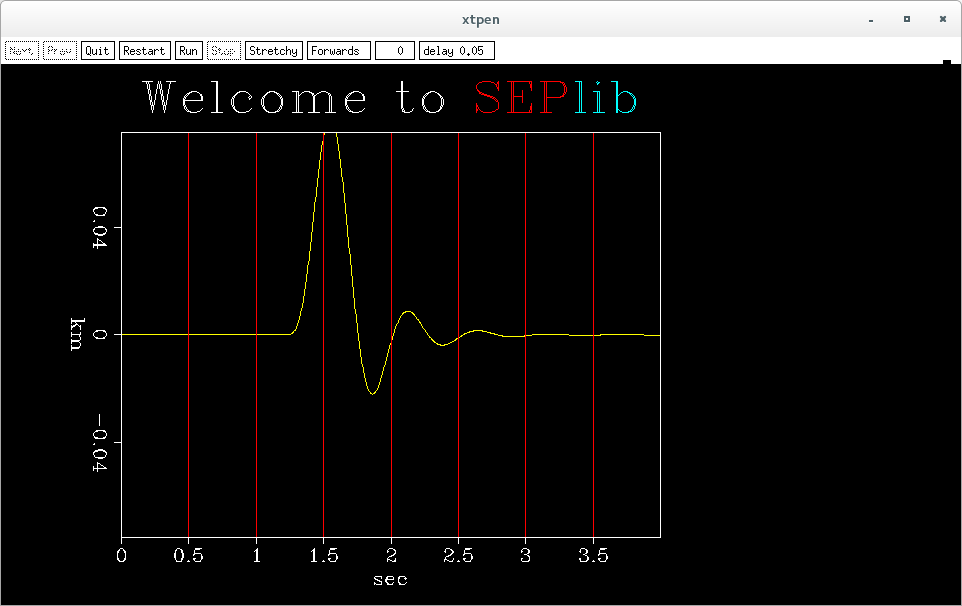

SEPlib安装
##############

:date: 2016-04-18
:author: pzhang
:category: SEPlib
:tags: SEPlib, 安装
:slug: SEPlib-install

.. contents::

很早之前就想安装SEPlib了，一直没成功。

依赖
================

- 编译器 intel Fortran complier
- flex
- fftw3
- lesstif (or openmotif)
- netpbm (for vplot)

安装依赖包::

    $ sudo yum install fftw3 fftw3-devel
    $ sudo yum install flex flex-devel
    $ sudo yum install lesstif lesstif-devel
    $ sudo yum install netpbm netpbm-devel netpbm-progs

编译安装
================

SEPlib安装需要配置，可以在 ``seplib-6.5.3/docs/config_examples`` 目录下找到一些
配置文件的例子参考。

我选择的是将以下内容保存为脚本 ``run_config.sh`` 来进行配置：

.. code-block:: bash

    #!/bin/bash
    # COMPILE SCRIPT FOR INTEL
    export FC="ifort -O3"
    export FFTW_FCLD="-L/usr/lib64 -lfftw3f"
    # MPI支持目前报错，暂时先注释掉
    #export MPI_FLAGS="-I/usr/include/mpich-x86_64/"
    #export MPI_FCLD="-L/usr/lib64/mpich/lib -lmpichf90 -lfmpich -lmpich"
    export PERL="/usr/bin/perl"
    export PPM_INC="-I/usr/include/netpbm"
    export PPM_LD="-L/usr/lib64 -lnetpbm"

    ./configure --prefix=/home/pzhang/SEIS/seplib --with-local --with-su=/home/pzhang/SEIS/cwp --with-fftw

Debug
-------------------

然后在终端里输入::

    $ bash run_config.sh
    $ gmake

这时会报错，

.. code-block:: fortran

    super_chain_mod.f90(79): error #7061: The characteristics of dummy argument 1 of the associated actual procedure differ from the characteristics of dummy argument 1 of the dummy procedure.   [FLAT_CHAIN_ADJ_EXEC]
    call chain20( flat_chain_adj_exec,flat_chain_exec,adj, add, model, data,temp2)
    ------------------^

经过Google后发现是由于在调用 ``chain20`` 这个函数时，传入的函数类型和声明的不匹配。

我们需要修改 ``seplib-6.5.3/seplib_base/lib/seis/dip/super_chain_mod.f90``
文件。

修改第50行，将

.. code-block:: fortran

    logical       :: adj, add,adj_new

改为

.. code-block:: fortran

    logical,intent(in)  :: adj, add
    logical             :: adj_new

其他出错的地方作类型的修改，分别位于第28，114以及141行处。总共需要修改5处！

除了该处错误，在编译 ``RickMoive`` 和 ``Ricksep`` 这两个包时，也会报错。这是由于没有
链接一些库文件导致的，需要进到相关目录中修改 ``Makefile`` 。 

安装
---------------

编译全部通过之后，::

    $ make install

然后添加环境变量即可

.. code-block:: bash

    export SEPROOT=/home/pzhang/SEIS/seplib
    export SEPINC=${SEPROOT}/include    
    export PATH=${PATH}:${SEPROOT}/bin
    export DATAPATH=$HOME/tmpData/SEPData/
    export PYTHONPATH=${SEPROOT}/lib/python
    

测试
=============

安装完成后，在终端输入::

    $ Spike n1=1000 k1=300 title="\s200 Welcome to \c2 SEP\c5 lib" \
        | Bandpass fhi=2. phase=1 | Wiggle | Tube

出现如下图形即安装成功：

参考
===============

#. https://software.intel.com/en-us/forums/intel-fortran-compiler-for-linux-and-mac-os-x/topic/472080
#. http://www.linuxidc.com/Linux/2010-01/23959.htm

