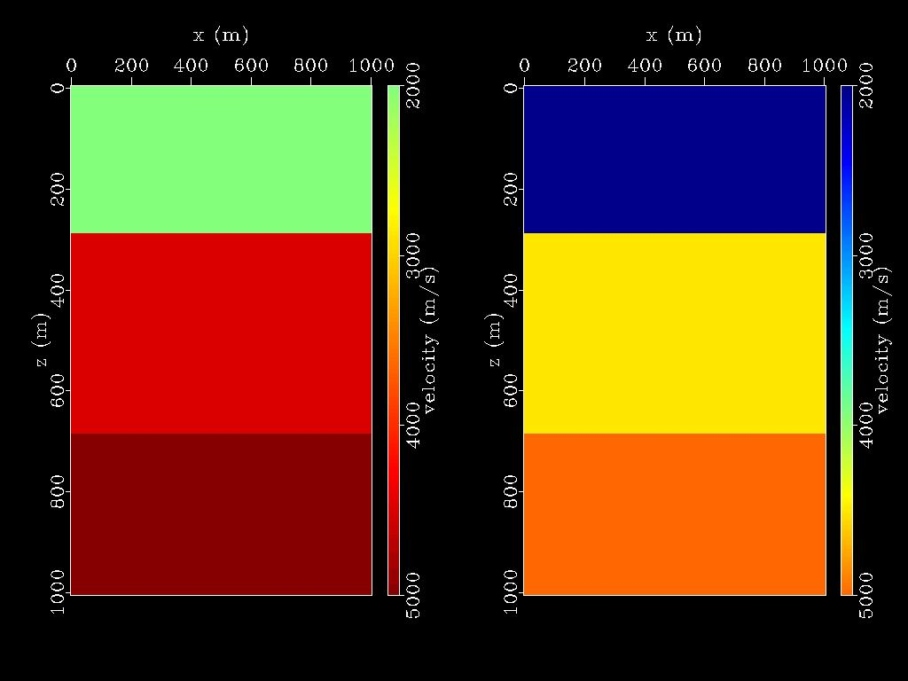

Madagacar之sfgrey
###############################

:author: pzhang
:date: 2016-06-01
:category: Madagacar
:tags: Madagacar, program of week
:slug: madagacar-sfgrey

.. contents::

sfgrey和sfgrey3
======================

Madagacar中可用 ``sfgrey`` 和 ``sfgrey3`` 来对数据进行可视化作图。在各种场景下都有
广泛地使用。

``sfgrey`` 和其他的绘图命令共享着很多相同的参数选项，例如 ``sfgraph``, ``sfwiggle`` 和
``sfcontour`` 。对于这些共同的参数选项可以通过 ``sfdoc stdplot`` 来查看或者在线网页
查看 `stdplot document <http://ahay.org/RSF/sfstdplot.html>`_

控制数据显示范围的参数有::

    clip=, pclip=, bias=, allpos=, mean=

默认的参数是 ``pclip=99`` ，表示数据会被裁剪成99%，若要显示完整的数据，可用 ``pclip=100`` 。
``bias=`` 控制范围的颜色中间值。默认是 ``bias=0`` ,对与地震数据是可行的。
当显示的数值全部大于bias的值时，设置参数 ``allpos=y`` （all positive）.
若想将bias值设为数据的平均值，不用显式地指定，直接设置参数 ``mean=y`` 即可。

下图为 ``bias=2000`` 和 ``mean=y`` 的对比图

