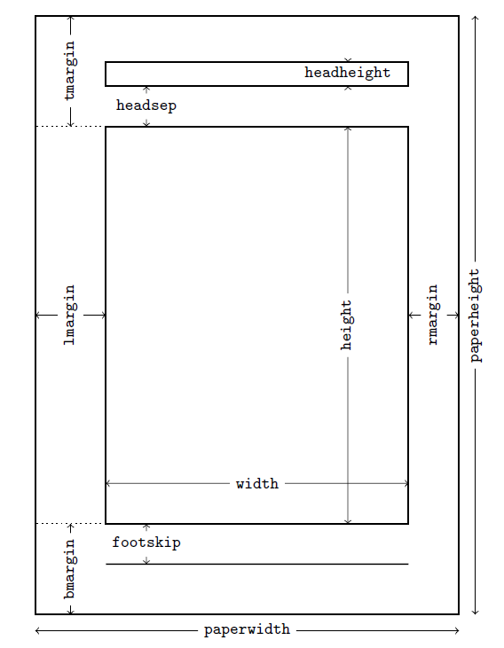

LaTeX 页面版式设置
########################

:date: 2016-04-22
:author: pzhang
:category: LaTex
:tags: LaTex
:slug: geometry-fancyhdr
:summary: 

.. contents::

LaTeX页面版式说明
=======================

在LaTex写作中，对于页面布局的要求都不尽相同。页面尺寸是由一系列长度变量控制的。
具体的可见下表格及图，表中只列举了一小部分。

+------------------+------------------------------+
| 参数             | 描述                         |
+==================+==============================+
| ``\paperwidth``  | 纸张宽度                     |
+------------------+------------------------------+
| ``\paperheight`` | 纸张高度                     |
+------------------+------------------------------+
| ``\textwidth``   | 版心宽度                     |
+------------------+------------------------------+
| ``\textheight``  | 版心高度                     |
+------------------+------------------------------+
| ``\topmargin``   | 额外的上边距                 |
+------------------+------------------------------+
| ``\headheight``  | 页眉高                       |
+------------------+------------------------------+
| ``\footskip``    | 页脚基线与最后一行基线的间距 |
+------------------+------------------------------+
| ...              | ...                          |
+------------------+------------------------------+

对于众多的页面参数，我们要设置起来太过麻烦。而geometry宏包正是将其简便化的一个工具。

geometry宏包与页面大小
==========================

geometry主要提供两种方式来设置页面版式，一是作为宏包的选项：

.. code-block:: latex

    \usepackage[a4paper, left=3cm, right=3cm]{geometry}

二是使用 ``\geometry`` 命令，内容和宏包选项一样：

.. code-block:: latex

    \usepackage{geometry}
    \geometry{a4paper, left=3cm, right=3cm}

geometry宏包支持方便的 ``key=value`` 语法，会根据给出的页面距离值和其他参数的默认值，
自动计算原始 LaTeX 的页面参数进行设置。

fancyhdr宏包与页面格式
===========================

