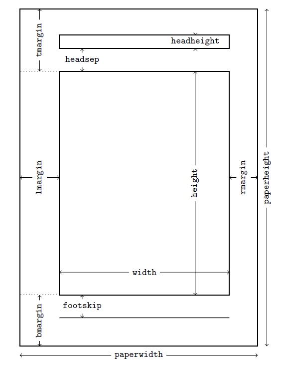

Geometry宏包使用
########################

:date: 2016-04-22
:author: pzhang
:category: LaTex
:tags: LaTex
:slug: geometry
:summary: geometry宏包使用

.. contents::

在LaTex写作中，geometry宏包是设置版面样式的基本宏包了。本文主要整理记录该宏包
的各种参数及其含义。

下图表示geometry宏包中定义的页面布局。包括：total body(可打印区域)和margins(页边距)。
total body是由 body（文字区域）和一个可修改的 header，footer和页边批注组成。一共有四类页边距：
left、right、top和bottom。对双面打印的文章来说，水平页边距通常叫做inner和outer。

