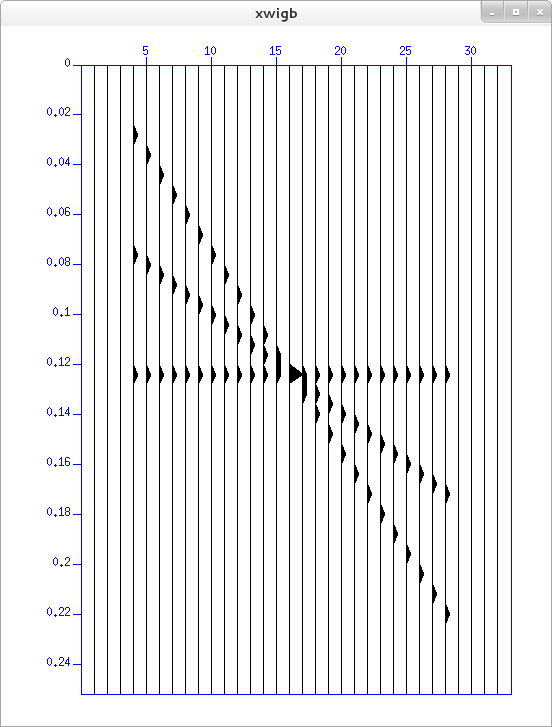

Linux下安装Seismic_Unix
#############################

:author: pzhang
:date: 2015-10-07
:category: Linux
:tags: Linux, 安装
:slug: install-seismic-unix

.. contents::

Seismic_Unix 是科罗拉多矿业大学开发的一个地震数据处理的软件，以勘探地震为主。
本文记录在Linux下安装Seismic_Unix的过程。

依赖
=====

待定

下载
======

官方网站： http://www.cwp.mines.edu/cwpcodes/

下载最新的源代码即可

安装
======

添加环境变量
----------------

.. code-block:: bash

    $ echo "export CWPROOT=/opt/cwp/" >> ~/.bashrc
    $ echo "export PATH=${PATH}:${CWPROOT}/bin" >> ~/.bashrc
    $ exec $SHELL
    
解压和配置
-----------

解压下载的文件包，我下载时最新版本为 \ ``cwp_su_all_44R0.tgz``\

.. code-block:: bash

    $ tar xvf cwp_su_all_44R0.tgz
    
然后进到解压出来的 \ ``src``\文件夹

.. code-block:: bash

    $ cd src
    $ cp configs/Makefile.config_Linux_x86_64 Makefile.config   # 根据自己系统选择

然后对 \ ``Makefile.config``\进行配置。

.. code-block:: bash

    # LINEHDRFLAG = 
    # XDRFLAG =  -DSUXDR
    ENDIANFLAG = -DCWP_LITTLE_ENDIAN
    LARGE_FILE_FLAG = -D_FILE_OFFSET_BITS=64 -D_LARGEFILE64_SOURCE

说明：
 
- \ ``LINEHDRFLAG=SU_LINEHEADER``\:
    adds 3200 byte text & 400 byte SEG-Y style line headers to output.
    CWP/SU always reads either format unless SUXDR has been selected.
    
- \ ``XDRFLAG=-DSUXDR``\: 
    forces all SU data to be big endian independent of processor architecture

- \ ``LARGE_FILE_FLAG``\: 
    controls access to files > 2 GB on some systems.

- \ ``-DSLTSU_SEGY_H``\:
    if defined selects SLT/SU trace header layout so both packages are compatible

正式安装
--------

将src文件夹移动到\ ``CWPROOT``\,即 \ ``/opt/cwp/``\

.. code-block:: bash

    $ sudo mv src /opt/cwp/
    $ cd /opt/cwp/src
    $ su
    # make install
    # make xtinstall
    # make finstall
    # make mglinstall
    
至此 SU 已安装完成。

测试
========

.. code-block:: bash

    $ suplane | suxwigb &
    
此时出现如下图形便是安装成功！

    
参考
=======

- `安装seismic unix（SU）软件 <http://blog.sina.com.cn/s/blog_4a7322eb0101bsm1.html>`_                           

