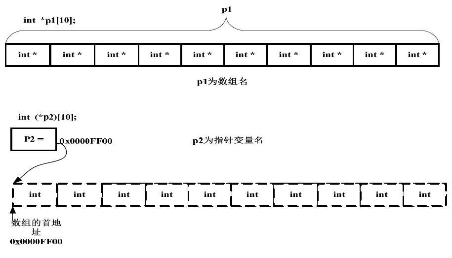

数组和指针
##############

:date: 2015-07-31
:author: pzhang
:category: Programming
:tags: C, 
:slug: array-and-pointers

.. contents::

数组名和指针
==============

在C语言中，数组和指针是紧密联系在一起的，对于数组来说，数组名就是数组第一个元素的地址，
不同的是数组名是一个常量，而指针则是变量。这是两者之间的最主要区别。

事实上，数组名和指针除了上述区别外，还有其他的一些不同：

#. 在声明时，只有作为函数参数的数组名编译器会将其转化成指针。其他情况下，数组名和指针是完全不一样的。

#. 在引用上，数组名只需访问内存一次；而指针需要访问内存两次。

#. 若a是一个数组名，p为指向该数组的指针变量，使用 \ ``a``\和\ ``&a``\得到的值是一样的。对p来说则不一样

#. \ ``sizeof a``\得到的是整个数组所占字节的大小，而\ ``sizeof p``\得到的是指针所占字节的大小(32位系统为4个字节，64位系统为8个字节)

#. 尽管\ ``a``\和\ ``&a[0]``\得到的地址是一样的，但是其意义是不一样的，\ ``a``\表示的是存储数组这块连续内存空间的首地址而\ ``&a[0]``\表示的是数组第一个元素的首地址。
   
举例说明：

.. code-block:: c

    #include <stdio.h>
    #include <stdlib.h>
    #define SIZE 5

    void show_arr(const int a[], int n); // const是为了保护数组内容
    int sum_arr(const int a[], int n); // 这里和int sum_arr(const int *a, int n)是一样的

    int main(void)
    {
        int a[SIZE];
        int *p;

        for (int i=0; i<SIZE; i++) // 初始化 产生10以内的随机数
            a[i] = rand()%10 + 1;

        p = a; // 将指针变量指向数组

        printf("a = %p\n&a = %p\n", a, &a); // a和&a都为数组开始的地址
        printf("p = %p\n&p = %p\n\n", p, &p); // p指向数组开始，&p则为存储指针p的地址

        printf("sizeof a = %d\n", sizeof a); // 数组a包含int类型的5个元素
        printf("sizeof p = %d\n\n", sizeof p); // 指针占字节数与系统位数有关，64位系统占8个字节

        printf("The contents of array are: \n");
        show_arr(a, SIZE);
        printf("\nSum of all elements is: %d\n", sum_arr(a, SIZE));

        return 0;
    }

    void show_arr(const int a[], int n) {
        for (int i=0; i<n; i++)
            printf("%3d ", a[i]);
    }

    int sum_arr(const int a[], int n) {
        int total = 0;

        for (int i=0; i<n; i++)
            total += a[i];

        return total;
    }

编译:\ ``gcc test.c -std=c99``\

输出如下：
::

    a = 000000000022FE30
    &a = 000000000022FE30
    p = 000000000022FE30
    &p = 000000000022FE28

    sizeof a = 20
    sizeof p = 8

    The contents of array are:
      2   8   5   1  10
    Sum of all elements is: 26

指针数组和数组指针
==================

常常被这两个概念弄晕，其实用英文更加好理解。

- **指针数组**:  an array of pointers, 首先它是一个数组，数组元素都为指针
- **数组指针**： a pointer to an array, 首先它是一个指针，指向一个数组，也称行指针
  
其用法区别如下：

+ \ ``int *ar[10]``\
    * 指针数组
    * 表示： ar是包含10个int类指针的数组
    * 元素表示： \ ``*ar[i]``\和\ ``*(ar[i])``\ 是一样的, \ ``[]``\优先级高于\ ``*``\

+ \ ``int (*pt)[10]``\
    * 数组指针
    * 表示： pt为指向包含10个int值数组的指针
    * 元素表示： \ ``(*ar)[i]``\

指针数组比较好理解，就是用来存储指针的数组。举例说明：

.. code-block:: c

    #include <stdio.h>

    int main(void)
    {
        int i = 1, j = 2;
        int *a[2];

        // 数组a用来存储两个指针
        a[0] = &i; // a[0]和a[1]分别指向i和j
        a[1] = &j;

        printf("*a[0] = %d\n*a[1] = %d\n", *a[0], *a[1]);

        return 0;
    }

输出如下::

    *a[0] = 1
    *a[1] = 2

但是数组指针就看起看有点奇怪了。

我们平时定义指针都是在数据类型后面加上指针变量名，但是数组指针为什么却是按
\ ``int (*pt)[10]``\来定义？其实数组指针的原型是这样的：\ ``int (*)[10] pt``\,
\ ``int (*)[10]``\是指针类型，表示指针变量\ ``pt``\指向一个包含有10个int值的数组； \ ``pt``\每加1，就跳过\ ``10 * sizeof(int)``\个字节。

将数组指针当作 **行指针** 也比较好理解，举例：

.. code-block:: c

    #include <stdio.h>
    #define ROWS 4
    #define COLS 2

    int main(void)
    {
        int a[ROWS][COLS] = { {2,4}, {6,8}, {1,3}, {5,7} };
        int (*p)[2]; // 声明数组指针

        p = a;
        // 将其指向数组a,这里p指向第一个含有两个int值的数组,即a[0]
        // 那么 p+1 指向第二个大小为2个int的数组

        for (int i=0; i<ROWS; i++)
            printf("p+%d = %p\n", i, p+i);

        for (int i=0; i<ROWS; i++)
            printf("*p+%d = %p\n", i, *p+i);

        for (int i=0; i<ROWS; i++) {
            for (int j=0; j<COLS; j++)
                printf("*(*(p+%d)+%d) = %d\t", i, j, *(*(p+i)+j));
        printf("\n");
        }

        int *start = *p; // *p == &a[0][0]
        int * const end = start + ROWS*COLS;
        // 将二维数组当成一维数组来循环
        for ( ; start != end; start++)
            printf("%-3d", *start);
        putchar('\n');

        return 0;
    }

输出：
::

    p+0 = 000000000022FE00
    p+1 = 000000000022FE08
    p+2 = 000000000022FE10
    p+3 = 000000000022FE18
    *p+0 = 000000000022FE00
    *p+1 = 000000000022FE04
    *p+2 = 000000000022FE08
    *p+3 = 000000000022FE0C
    *(*(p+0)+0) = 2 *(*(p+0)+1) = 4
    *(*(p+1)+0) = 6 *(*(p+1)+1) = 8
    *(*(p+2)+0) = 1 *(*(p+2)+1) = 3
    *(*(p+3)+0) = 5 *(*(p+3)+1) = 7
    2  4  6  8  1  3  5  7

从这段代码结果我们可以看出：

#. p每加1都跳过 \ ``2 * sizeof(int)``\个字节；而\ ``*p``\每加1则只跳过 \ ``sizeof(int)``\个字节

#. \ ``p+1``\和\ ``*(p+1)``\值是一样的，但是意义不同，与数组中\ ``a``\和\ ``&a[0]``\的关系类似,前者表示的是整个数组内存块开始的地址，后者表示的是每个数组首元素的地址。

#. 可以将数组指针理解为指针的指针，需要两次取值运算才能得到存储的值。

#. 数组指针p的用法和二维数组名a的用法是一样的，尽管其为一个指针变量，仍然可以使用p[2][1]这样的符号。表示单个元素的时候，数组名和数组指针都可行： \ ``a[m][n] = *(*(a+m)+n)``\或\ ``p[m][n] = *(*(p+m)+n)``\

#. 二维数组可以当作特殊的一维数组，上述代码利用一个for循环就遍历了一个二维数组也说明了这一点。
   

参考
=========

#. `数组指针和指针数组 <http://blog.csdn.net/touch_2011/article/details/6966980>`_
#. `C Primer Plus, 6th Edition <http://www.informit.com/store/c-primer-plus-9780321928429>`_
#. `数组指针和指针数组的区别 <http://www.cnblogs.com/mq0036/p/3382732.html>`_
