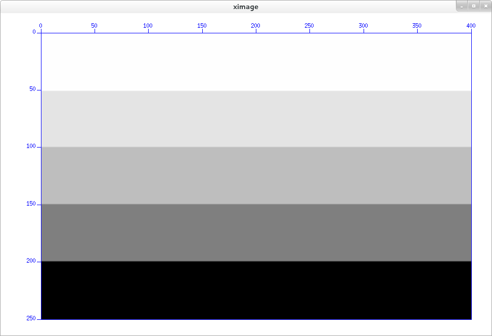

SU下速度模型的建立
####################

:date: 2015-10-14
:author: pzhang
:category: Seismic_Unix
:tags: SU
:slug: creat_velocity_model_under_su

.. contents::

本文主要记录利用C语言建立在Seismic_Unix下能用的二进制速度模型。

**值得注意的是，SU下的速度模型是按照列为主来存储和读取的，这和C语言以行为主存储多维数组的方式不同。**

层状模型
==========

建立每层速度不同的简单层状模型, 其中心思想就是利用循环将每层X 方向的速度值设为相同.

.. code-block:: C

    #include <stdio.h>
    #include <stdlib.h>
    #include "cwp.h"

    int main(void)
    {
        int nx=401, nz=251;     // X方向和Z（深度）方向的网格点数 

        FILE *vfp = fopen("vel.bin", "wb");
    
        float *v = alloc1float(nx*nz); // 利用 SU 里 alloc.c 中的函数分配一个一维数组
        int i, j;
        float vel;
        
        // 分为5层， 速度分别如下
        // 按列来赋值
        for (i=0; i<nx; i++)
            for (j=0; j<nz; j++) {
                if (j<=50)
                    v[i*nz+j] = 2000.0;
                else if (j<100)
                    v[i*nz+j] = 2200.0;
                else if (j<150) 
                    v[i*nz+j] = 2500.0;
                else if (j<200)
                    v[i*nz+j] = 3000.0;
                else
                    v[i*nz+j] = 4000.0;
            }

        fwrite(v, sizeof(float), nx*nz, vfp);

        fclose(vfp);
        free1float(v);
        return 0;
    }

编译链接：

::

    $ gcc -o creat_mod creat_mod.c -I${CWPROOT}/include -L${CWPROOT}/lib -lcwp
    $ ./creat_mod

建立完成后，可以利用 \ ``ximage``\命令来查看。

.. code-block:: bash

    $ ximage <vel.bin n1=251
    
速度模型如下：

        

修改
=======
- 2015-10-14: 初稿
